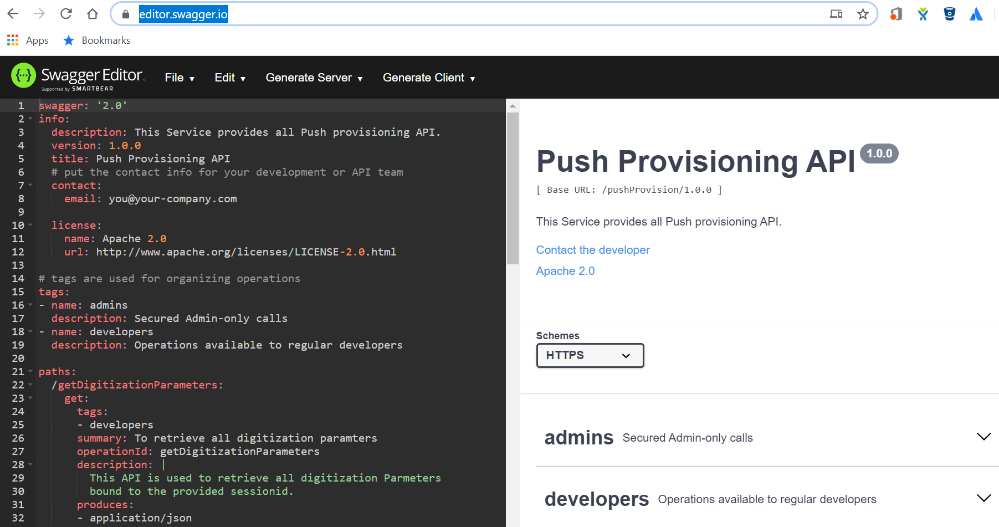
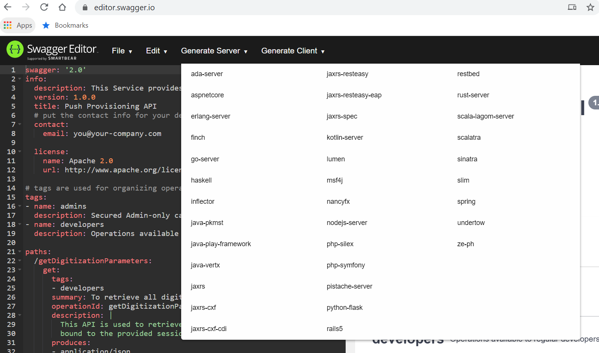
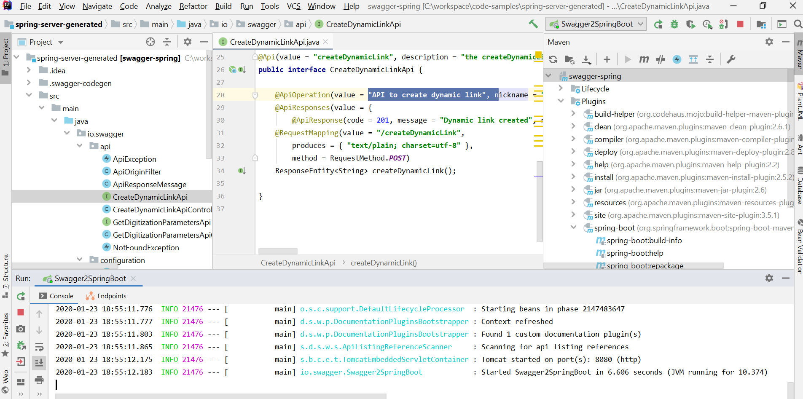
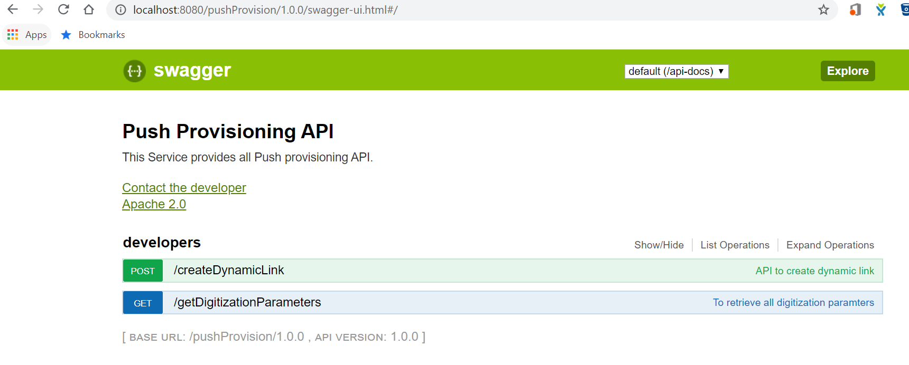

# Swagger how to guide

[Swagger](https://swagger.io/) is a tool used to Design, Document ,Build and Test the API and this document covers how to achieve the same.

 
-  ## Design API
    - [Swagger Online Editor](https://editor.swagger.io/) provides you way to create the API specification. 
    - You can create API spec in YAML or JSON format. Below is sample format for the same 
        
        
- ## Document API
    - Once API spec is ready we can convert the spec to asciidoc using AsciiDoctor and Swagger2markup gradle plugins.
    - After running gradle job it generates following files under **build/asciidoc/generated** package. 
    - Following are list of files.
        - [X] definitions.doc
        - [X] overview.doc
        - [X] paths.doc
        - [X] security.doc
    - Now we require to combine all above doc into one to build complete API spec, hence create new **api.adoc** file and add following snippet it and your doc is ready.
        ```asciidoc
          include::overview.adoc[]
          include::definitions.adoc[]
          include::paths.adoc[]
          include::security.adoc[]
        ```
- ## Build
   - With [Swagger Online Editor](https://editor.swagger.io/), there is option to generate Server, where there are ample options on which language we can generate server.
   - For example if we select spring as per below screenshot, it builds the entire Spring REST API with Swagger integration and it save lots of time to manually create those API.
    
   - Unzip the built code and import it to your favourite IDE, and just run the Spring boot Application and you can see that those rest API are working.
    

- ## Test
    - Swagger comes with web based testing tool, so if we have generated API from Swagger and run that ,it would start the testing editor as part of it.
    - As part of springboot application we build in previous step, once you run APP then Swagger Testing tool runs on **http://localhost:port/applicationcontext/**
    - When you hit the url it opens page like below, where you can test API easily.
     